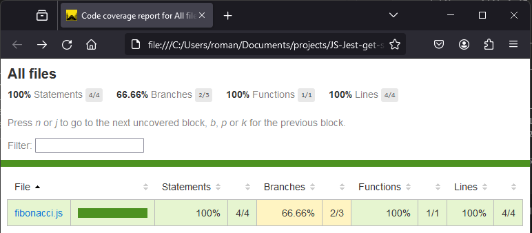
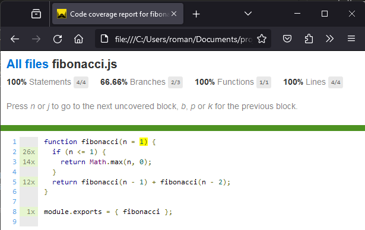

# Install Jest

Open a Terminal and run:

```
npm i --save-dev jest
```

This creates the following **package.json**:

```json
{
  "devDependencies": {
    "jest": "^29.7.0"
  }
}
```

Now add a script line that runs Jest so that your package.json will look like this:

```json
{
  "devDependencies": {
    "jest": "^29.7.0"
  },
  "scripts": {
    "test": "jest"
  }
}
```

# Example

Create a `src` directory for source files and a `test` directory for test files.

Create the `fibonacci.js` file in the src directory with the following content:

```js
function fibonacci(n = 1) {
  return -1;
}

module.exports = { fibonacci };
```

We will implement the function later, for now this dummy implementation will do as we want to use Jest to develop using the test driven development approach (TDD).

Thus, we create our first test, add the `fibonacci.test.js` file in the test directory with the following content:

```js
const { fibonacci } = require("../src/fibonacci");

describe("fibonacci function", () => {
  test("fibonacci(1)", () => {
    expect(fibonacci(1)).toBe(1);
  });
});
```

If we now run `npm run test` we get the following result:

```
> test
> jest

 FAIL  test/fibonacci.test.js
  fibonacci function
    × fibonacci(1) (4 ms)

  ● fibonacci function › fibonacci(1)

    expect(received).toBe(expected) // Object.is equality

    Expected: 1
    Received: -1

      3 | describe("fibonacci function", () => {
      4 |   test("fibonacci(1)", () => {
    > 5 |     expect(fibonacci(1)).toBe(1);
        |                          ^
      6 |   });
      7 | });
      8 |

      at Object.toBe (test/fibonacci.test.js:5:26)

Test Suites: 1 failed, 1 total
Tests:       1 failed, 1 total
Snapshots:   0 total
Time:        0.375 s, estimated 1 s
Ran all test suites.
```

We see that Jest finds our test automatically and we fail the test.

As we now have a failing test, we want to implement the minimum amount of code to pass the test!

Thus, we change the `fibonacci.js` file:

```js
function fibonacci(n = 1) {
  return n;
}

module.exports = { fibonacci };
```

This will still not return all the fibonacci numbers, but it is the minimum change to pass the test:

```
 PASS  test/fibonacci.test.js
  fibonacci function
    √ fibonacci(1) (2 ms)

Test Suites: 1 passed, 1 total
Tests:       1 passed, 1 total
Snapshots:   0 total
Time:        0.372 s, estimated 1 s
Ran all test suites.
```

Thus, we create another test to make sure that our function actually calculates fibonacci numbers!

Thus, we append our `fibonacci.test.js` file like this:

```js
const { fibonacci } = require("../src/fibonacci");

describe("fibonacci function", () => {
  test("fibonacci(1)=1", () => {
    expect(fibonacci(1)).toBe(1);
  });
  test("fibonacci(6)=8", () => {
    expect(fibonacci(6)).toBe(8);
  });
});
```

When we now run `npm run jest` again, we get the following result:

```
  FAIL  test/fibonacci.test.js
  fibonacci function
    √ fibonacci(1)=1 (1 ms)
    × fibonacci(6)=8 (2 ms)

  ● fibonacci function › fibonacci(6)=8

    expect(received).toBe(expected) // Object.is equality

    Expected: 8
    Received: 6

       6 |   });
       7 |   test("fibonacci(6)=8", () => {
    >  8 |     expect(fibonacci(6)).toBe(8);
         |                          ^
       9 |   });
      10 | });
      11 |

      at Object.toBe (test/fibonacci.test.js:8:26)

Test Suites: 1 failed, 1 total
Tests:       1 failed, 1 passed, 2 total
Snapshots:   0 total
Time:        0.282 s, estimated 1 s
Ran all test suites.
```

Now we can fix the fibonacci function again:

```js
function fibonacci(n = 1) {
  if (n <= 1) {
    return Math.max(n, 0);
  }
  return fibonacci(n - 1) + fibonacci(n - 2);
}

module.exports = { fibonacci };
```

When we now run `npm run test` we pass the tests, and we can confidently say that our fibonacci function is sound:

```
 PASS  test/fibonacci.test.js
  fibonacci function
    √ fibonacci(1)=1 (2 ms)
    √ fibonacci(6)=8

Test Suites: 1 passed, 1 total
Tests:       2 passed, 2 total
Snapshots:   0 total
Time:        0.392 s, estimated 1 s
Ran all test suites.
```

Now it is your time to unit test in your JavaScript projects as well as to introduce the test driven development approach 🚀🥊🚀

# Code Coverage

To make sure that your tests cover the entirety of the code base, you can also check the code coverage with Jest!

To test for coverage, add the following `jest --coverage` script to your package.json:

```
  "scripts": {
    "test": "jest",
    "coverage": "jest --coverage --coverageDirectory=coverage"
  }
```

Then run `npm run coverage` in the terminal:

```
 PASS  test/fibonacci.test.js
  fibonacci function
    √ fibonacci(1)=1 (5 ms)
    √ fibonacci(6)=8

--------------|---------|----------|---------|---------|-------------------
File          | % Stmts | % Branch | % Funcs | % Lines | Uncovered Line #s
--------------|---------|----------|---------|---------|-------------------
All files     |     100 |    66.66 |     100 |     100 |
 fibonacci.js |     100 |    66.66 |     100 |     100 | 1
--------------|---------|----------|---------|---------|-------------------
Test Suites: 1 passed, 1 total
Tests:       2 passed, 2 total
Snapshots:   0 total
Time:        0.782 s, estimated 1 s
Ran all test suites.
```

While executing the tests, Jest will now also check if we hit every statement, every branch or if condition, as well as every function and every line.

We get this nice report which says that our tests cover everything except one branch!

To see which branch we did not cover in our tests, we can open up the coverage report in the now newly created `coverage` directory.<br>
In there you can find another directory called `lcov-report`:<br>
In this directory you will find an index.html file which you can open with your internet browser:<br>
<br>
We see that the fibonacci.js filename provides a link to get further information about the missing branch coverage. Thus, we follow the link to the fibonacci.js report:<br>
<br>
Highlighted in yellow, we see the part of our code that was not executed.
It shows that the fibonacci function was never called without any parameters.
Thus, the default parameter was not covered during our tests.

To achieve 100% test coverage, which is generally always the goal, we introduce another test to our test suite in the `fibonacci.test.js` file:

```js
test("fibonacci()=1", () => {
  expect(fibonacci()).toBe(1);
});
```

As we now call the fibonacci function without any parameter, the default parameter will be used, and thus we achieve test coverage over our whole project.

To test this, we run `npm run coverage` again:

```
 PASS  test/fibonacci.test.js
  fibonacci function
    √ fibonacci(1)=1 (2 ms)
    √ fibonacci(6)=8 (1 ms)
    √ fibonacci()=1

--------------|---------|----------|---------|---------|-------------------
File          | % Stmts | % Branch | % Funcs | % Lines | Uncovered Line #s
--------------|---------|----------|---------|---------|-------------------
All files     |     100 |      100 |     100 |     100 |
 fibonacci.js |     100 |      100 |     100 |     100 |
--------------|---------|----------|---------|---------|-------------------
Test Suites: 1 passed, 1 total
Tests:       3 passed, 3 total
Snapshots:   0 total
Time:        0.461 s, estimated 1 s
Ran all test suites.
```

Now our test cover the entire project, we should keep this high standard up while we continue to develop our project.

Code Coverage lets us know if we have dead code and untested paths through our code, and is thus a great metric to uphold good code quality!
